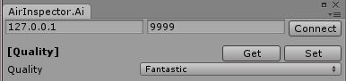
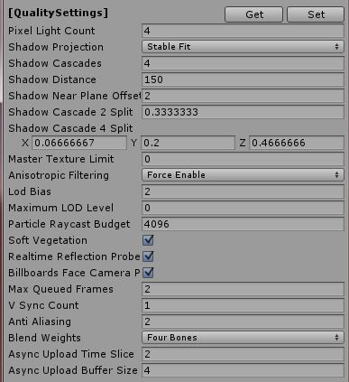
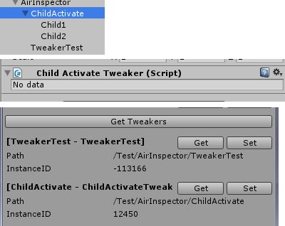
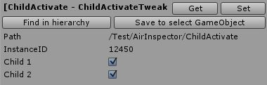
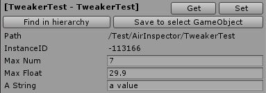

# Air Inspector

## Instruction

* Try to find matched quality and various parameters for different device, this tool is built to adjust them on the fly.
* Depends on [Device Profiles](https://github.com/bluesky139/UnityCommonUtilities/blob/master/docs/DeviceProfiles.md).

## Usage

### Basic
* Call `AirMgr.instance.Update()` in `MonoBehaviour.Update()`.
* Build and run game on mobile device.
* Open menu `Common -> AirInspector`, enter ip of your mobile device, press connect.
* Usable functions will be shown after connected.
* Demo: [https://github.com/bluesky139/UnityCommonUtilities/blob/master/Assets/Test/AirInspector/AirInspectorTest.cs](https://github.com/bluesky139/UnityCommonUtilities/blob/master/Assets/Test/AirInspector/AirInspectorTest.cs)

### Adjust quality
* 
* In `[Quality]`, use `Get` to get current quality, select a different quality, use `Set` to set it to device.
* Once got a better quality, set it to `DeviceProfiles.xlsx`.

### Adjust quality settings
* 
* In `[QualitySettings]`, use `Get` to get current quality settings, change them what you want, use `Set` to set them to device.
* Once got a better quality, set those values to `Editor -> Project Settings -> Quality`.

## Tweakers
* 
* Tweakers are used to adjust various paramters for GameObject, just like the inspector in Unity Editor, but it's a simple version.
* Use `Get Tweakers` to get all running tweakers, each tweaker has `Get` `Set` button for checking/modifying values. See examples below.

### Adjust GameObject activation
* 
* `ChildActivateTweaker` is a predefined tweaker, imagine that, a GameObject has 2 childs, attach this tweaker to this GameObject, you will see these 2 childs in inspector window, check/uncheck them to enable/disable them.
* `Find in hierarchy` is used to find tweaker attached GameObject in hierarchy, also you can find it manually.
* `Save to select GameObject` is used to save current values to this tweaker, these values will be loaded at tweaker `Awake()`, thus, values can be loaded automatically for different quality. (Values are saved for corresponding quality, you need `Get` `[Quality]` first)

### Custom tweaker
* 
* Demo: [https://github.com/bluesky139/UnityCommonUtilities/blob/master/Assets/Test/AirInspector/TweakerTestBehaviour.cs](https://github.com/bluesky139/UnityCommonUtilities/blob/master/Assets/Test/AirInspector/TweakerTestBehaviour.cs)
* Parameters can from any class variable, also you can do extra things at `Set`.