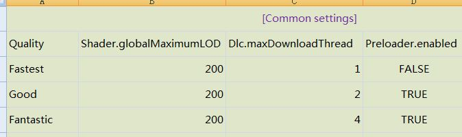

# Device Profiles

## Instruction

* Set quality by processor frequency, processor count, memory size, graphic device name...
* Set quality for specific devices.
* Rules are configured in one Excel sheet.

## Usage

### Code
* Call `DeviceProfiles.MatchAndSetWithProfile()` at game start.
* Call `DeviceProfiles.quality` to manually set quality if necessary.
* Demo: [https://github.com/bluesky139/UnityCommonUtilities/blob/master/Assets/Test/DeviceProfiles/DeviceProfilesTest.cs](https://github.com/bluesky139/UnityCommonUtilities/blob/master/Assets/Test/DeviceProfiles/DeviceProfilesTest.cs)

### Configure rules
* Open `./Assets/Plugins/DeviceProfiles/Editor/DeviceProfiles.xlsx`, there are 3 parts.

> 1. Common settings
> 
> 
>
> * You can set Unity built-in or custom static variable to different value by quality.

> 2. Auto match
>
> 
>
> * `MatchReg`: Match whole line of one system info.
> * `Target`: Which system info, from static variable in `UnityEngine.SystemInfo`.
> * `Compare`: Calculate operator.
> * `Value`: Expected value.
> * `Result`: The matched quality. 
> * The lowest quality will be used from all matched results.

> 3. Specific devices
>
> 
>
> * Parameters are same as `Auto match`, but you should set all `Target` to `deviceModel` to match specific device.
> * The 1st matched quality will be used, `Auto match` will be ignored.
> * You can also set `Common settings` for one specific device, put them on the right side.

### Build
* Use menu `Common -> Device Profiles -> Generate` to generate client readable config from `DeviceProfiles.xlsx`. You should generate it once again after modifying `DeviceProfiles.xlsx`.