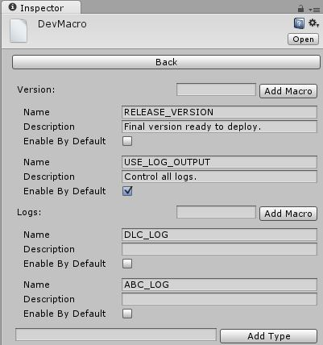
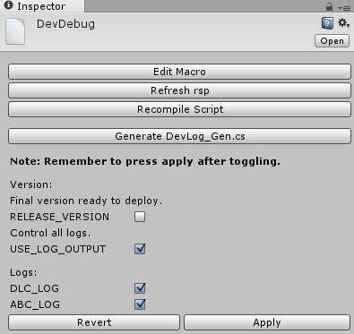

# Macro

## Instruction

* Add macro for all platforms at one time.
* Enable / Disable macro for everyone.
* Enable / Disable macro for yourself only, not take effect for others.
* Categorize logs by namespace, enable / disable one categorized log by macro.

## Usage

### Add macro
* Open menu `Common -> Macro -> Dev Debug -> Edit Macro`.
* 
* In `Add Type` line, enter a name for category, such as `Version` and `Logs`, this is only for display in editor.
* In each category, there's a `Add Macro` line, enter new macro name to be added. 
* Some description can be added for each macro, also you can enable / disable one macro by default.
* Remember to press `Apply` to take effect.

### Enable / Disable macro for yourself only
* Open menu `Common -> Macro -> Dev Debug`.
* 
* Enable / Disable listed macros, press `Apply` to take effect.
* Settings are saved in `DevDebug.asset`, this file should not be versioned, it's for yourself only.
* You can toggle `Enable By Default` in `Edit Macro` to override self configured macro, after that, you can toggle again in `Dev Debug` for yourself only.

### `Logs` macro
* `Logs` is a specific category, it's for log output, all macros need ends with `_LOG`.
* After new log macro is added, such as `DLC_LOG` and `ABC_LOG`, you can use `Common -> Macro -> Dev Debug -> Generate DevLog_Gen.cs` to generate `Debug` class by namespace separated, such as `dlc` and `abc`, then `Debug` class can be used as usual, but it's already controlled by generated classes (the generated `Debug` will be referenced rather than `UnityEngine.Debug`), simply toggle them like other macros.
* Demo: [https://github.com/bluesky139/UnityCommonUtilities/blob/master/Assets/Test/Macro/NamespaceAbcTest.cs](https://github.com/bluesky139/UnityCommonUtilities/blob/master/Assets/Test/Macro/NamespaceAbcTest.cs)